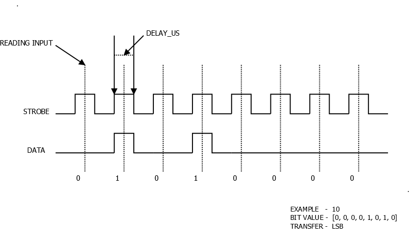

# GPIO Serial Communication Device

## Purpose
To develop my understanding of device driver concepts, I focused on developing loadable kernel modules with configurable parameters, implementing ioctl calls, and working with device tree overlays. This improved project based on the final project I completed as part of the [Advanced Embedded Linux Development specialization](https://coursera.org/share/984470e36325dfdacdcdbbe11a76e00d)

## Data Transfer Design
In this design, the strobe signal controls the timing, and on each rising edge, the value on the data line is captured. The data is transmitted sequentially, with each bit being read on the strobe's rising edge. 

The data is transmitted in the order of the least significant bit (LSB) to the most significant bit (MSB) in the below example, but it can be configured to transmit in the opposite direction.



## Testing Driver

Once the driver loaded we can use `echo` command to transfer data.,
```bash
$ echo helloworld > /dev/gpioserdev 
```

To receive the transferred data, a `test/recv.py` python script is used.,

```bash
$ cd test/
$ python3 recv.py
```